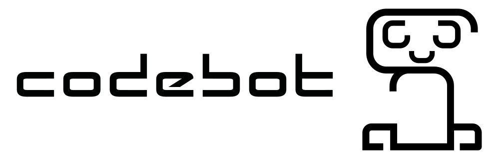

A friendly little guy meant to be used as a programming teaching resource.

# Supported Languages

* Java
* Python

# Components

Each subdirectory contains its own README file with more detailed information

## Hardware

* AVR328P
* UART - USB converter
* Servo motor
* 5V x 3A power supply
* LD293 (x2)
* Printer horizontal axis with stepper motor (x2)

## Software

* AVR firmware
* Haskell hardware control module
* Haskell Yesod web interface
